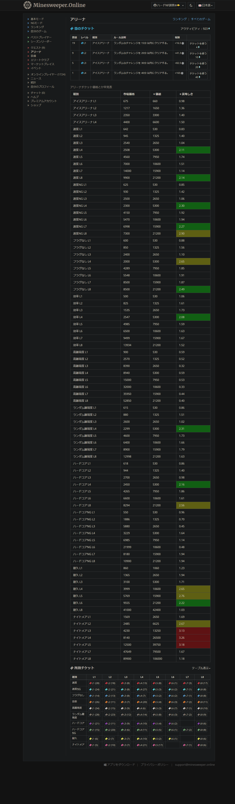

# mso_showArenaticketGoodValues
MSOのアリーナチケットの買い時を表示するブックマークレットです。

> [!NOTE]
> - 作った人: 魚頭男(https://minesweeper.online/ja/player/16842796)

> [!CAUTION]
> - 当コンテンツはMSO様より公認を受けていない非公認のものです。
> - 当コンテンツについてMSO様に問い合わせを絶対にしないでください。
> - 当コンテンツはMSO様ならびにプレイヤー様にご迷惑を掛けないよう努めておりますが、万一何かありましたら公開を取りやめいたします。

サンプル


> [!TIP]
> - 「＊価値」は、プレイヤーの装備や報酬それぞれの価格によって変動します。<br/>データ収集中にそれぞれの値を入力することができます。
> - 「＊美味しさ」は「換算値÷市場価値」で求めています。
> - 次回の実行時の入力省略のために、入力内容をlocalstorageへ保存しています。<br/>localstorageを消したい場合は、コンソールで以下のコマンドを入力してください。
```javascript
localStorage.removeItem("_魚頭男_S001_datas");
```

> [!IMPORTANT]
> - 持っているアリーナチケットの価格しか表示できません😭
